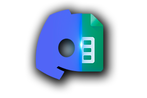

> Version 1.0 - Discord Bot that manages a Google Sheets File

A Discord Bot that extracts information from a Google Sheets File. It was created to manage a New World's players list.

## About this project

This project uses the Google Sheets API v4 and Discord.js API v13.

Requires node.js v16+.

Requires a [Google Cloud Console](https://console.cloud.google.com) project to generate credentials and token.

Requires a config.json file to include the bot's client token and prefix. **It is recommended to include the spreadsheet inside this file**.

## Usage

To start running this project you need to execute `npm install` to install dependencies.

To enable the bot once you have the required files execute `node .`.

To generate a new token execute `node newtoken.js`. **Your google account needs privileges inside your Google Project**

## Available commands

- showall - Displays the entire players list. It depends on the selected range for the spreadsheet.
- show *player* - Displays an embed message based on information of the selected player.
- help - Shows basic bot usage.

## Useful references
- [Google Sheets API](https://developers.google.com/sheets/api/quickstart/nodejs)
- [How to create a Google Cloud Project](https://developers.google.com/workspace/guides/create-project)
- [Discord.js Guide](https://discordjs.guide/#before-you-begin)
- [Discord.js Documentation](https://discord.js.org/#/docs/main/stable/general/welcome)
